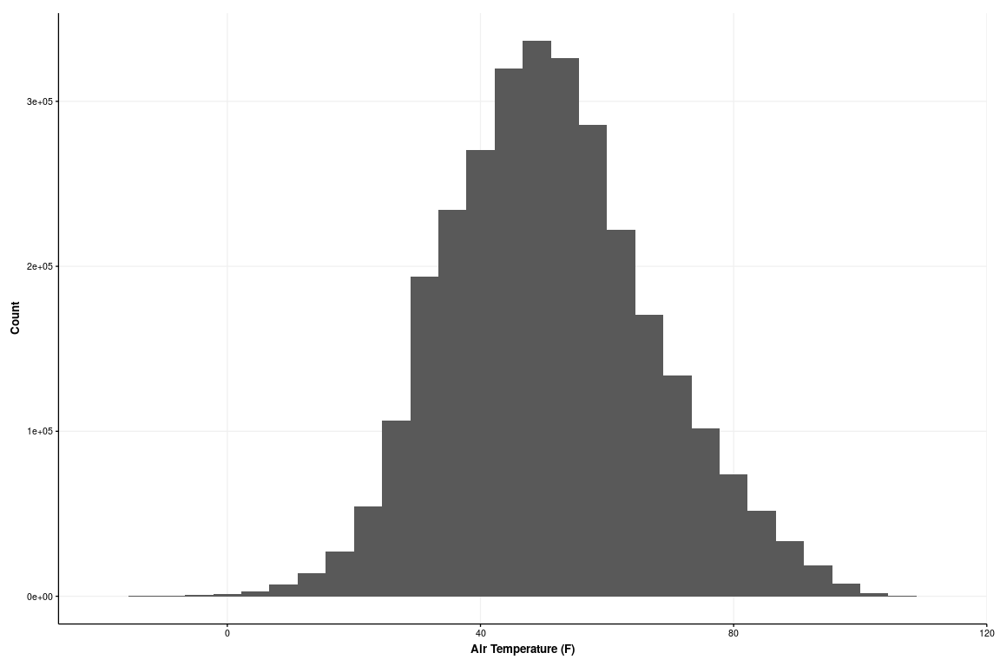
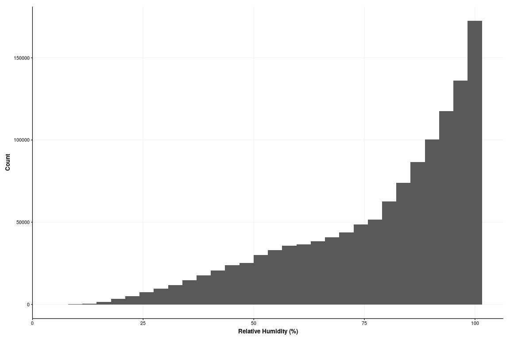
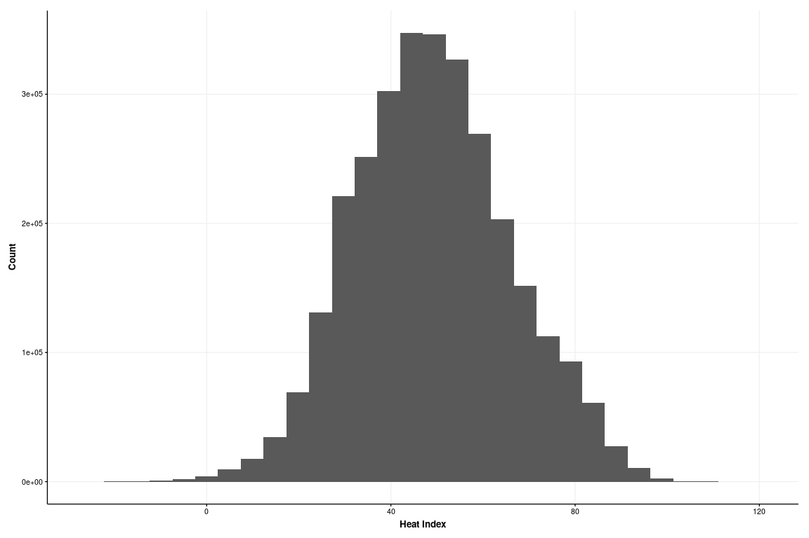
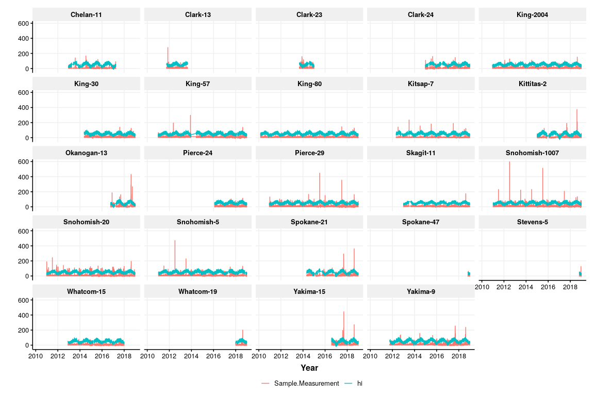
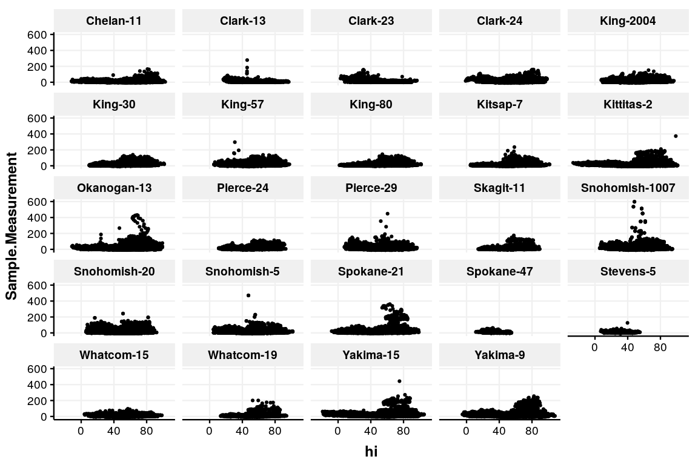

Washington PM2.5 and Heat Episides, 2010-2018
================

## METHODS

### Heat Episodes

  - Requested AWN data (with data QA date pre-2010) from locations
    nearest EPA PM sites for 2010-2018
  - 38 sites
  - Computed heat index

### PM Episodes

  - Downloaded [EPA PM data for
    2010-2018](#https://aqs.epa.gov/aqsweb/airdata/download_files.html)
  - 24/27 sites
  - Merged with heat episode data
  - Computed nearest Haversine distance between AWN and EPA sites

### Plots

  - Histograms for temp, relative humidity, and PM2.5 (PM2.5 FRM/FEM
    Mass (88101))
  - Time series
  - Scatter plot of heat index vs. PM, 2018-2018 by location (n=24)

### Maps

## RESULTS

``` r
ggplot(awn.1h, aes(x=AIR_TEMP_F))            + geom_histogram() + theme_HEI(10) + xlab("Air Temperature (F)") + ylab("Count")
```

    ## Warning: `legend.margin` must be specified using `margin()`. For the old
    ## behavior use legend.spacing

    ## `stat_bin()` using `bins = 30`. Pick better value with `binwidth`.

<!-- -->

``` r
ggplot(awn.1h, aes(x=`RELATIVE_HUMIDITY_%`)) + geom_histogram() + theme_HEI(10) + xlab("Relative Humidity (%)") + ylab("Count")
```

    ## Warning: `legend.margin` must be specified using `margin()`. For the old
    ## behavior use legend.spacing

    ## `stat_bin()` using `bins = 30`. Pick better value with `binwidth`.

<!-- -->

``` r
ggplot(awn.1h, aes(x=hi))                    + geom_histogram() + theme_HEI(10) + xlab("Heat Index") + ylab("Count")
```

    ## Warning: `legend.margin` must be specified using `margin()`. For the old
    ## behavior use legend.spacing

    ## `stat_bin()` using `bins = 30`. Pick better value with `binwidth`.

<!-- -->

``` r
#ggplot(data = awn.1h, mapping = aes(x = datetime, y = AIR_TEMP_F))            + geom_line() +  facet_wrap(facets =  vars(Site))
#ggplot(data = awn.1h, mapping = aes(x = datetime, y = `RELATIVE_HUMIDITY_%`)) + geom_line() +  facet_wrap(facets =  vars(Site))
#ggplot(data = awn.1h, mapping = aes(x = datetime, y = hi))                    + geom_line() +  facet_wrap(facets =  vars(Site))

#temp1 <- ggplot(jun10.temp, aes(x = time, y = value, color=factor(variable, labels = c("15-min Avg @ 2m", "1-min Avg @ 3m", "1-min Avg @ 10m", "10-sec Avg @ 10m")))) + geom_line(size=1, alpha=0.5) + ggtitle('') + xlab("") + ylab("Temperature (°C)") + scale_y_continuous(limits = c(12.5, 21)) + scale_x_datetime(date_breaks = "10 min", labels=date_format("%H:%M", tz = "")) + theme(legend.position="bottom", plot.title = element_text(hjust = 0.5), legend.title = element_blank()) + ggtitle("June 10, 2016") + theme_HEI(base_size=10)


#load("Data/hourly_88101_2010-2018_WA.Rdata")
```

``` r
ggplot(epa.awn.final.long, aes(x=datetime_PST, y=value, color=factor(variable))) + geom_line() + facet_wrap(facets = vars(Site)) + theme_HEI(12) + xlab("Year") + ylab("")
```

    ## Warning: `legend.margin` must be specified using `margin()`. For the old
    ## behavior use legend.spacing

<!-- -->

``` r
ggplot(epa.awn.final.wide, aes(x=hi, y=Sample.Measurement)) + geom_point(size=1) + facet_wrap(facets = vars(Site)) + theme_HEI(12) + xlab("Heat Index") + ylab("PM2.5 µg/m3")
```

    ## Warning: `legend.margin` must be specified using `margin()`. For the old
    ## behavior use legend.spacing

<!-- -->

## REFERENCES
