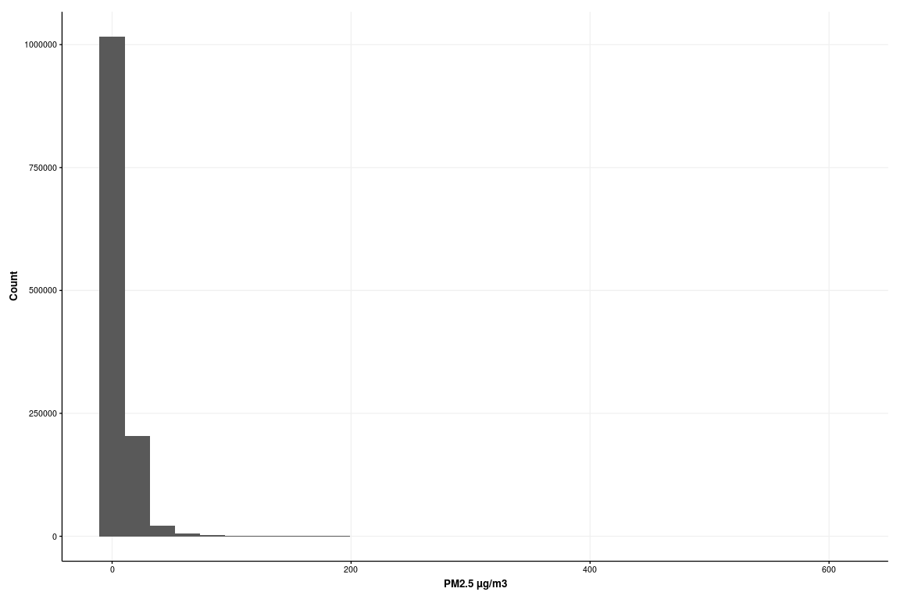
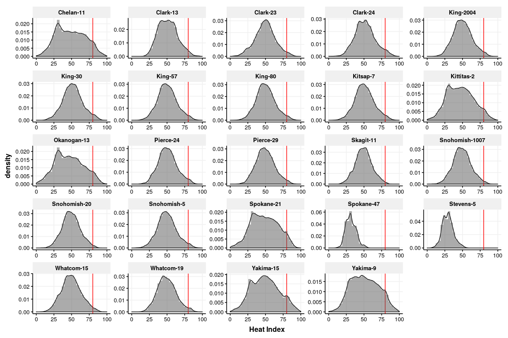
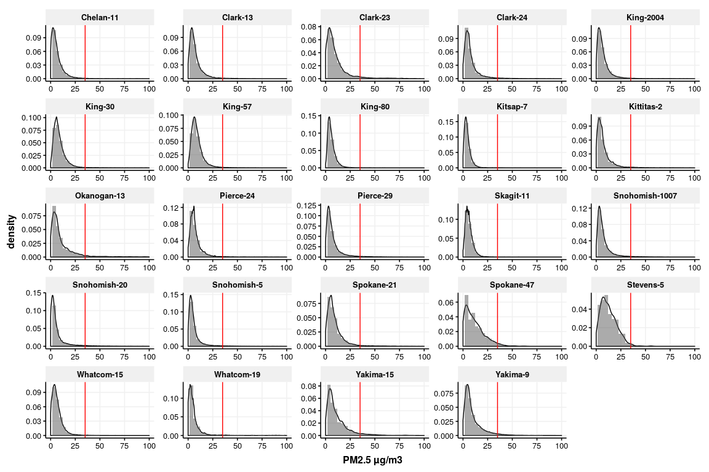
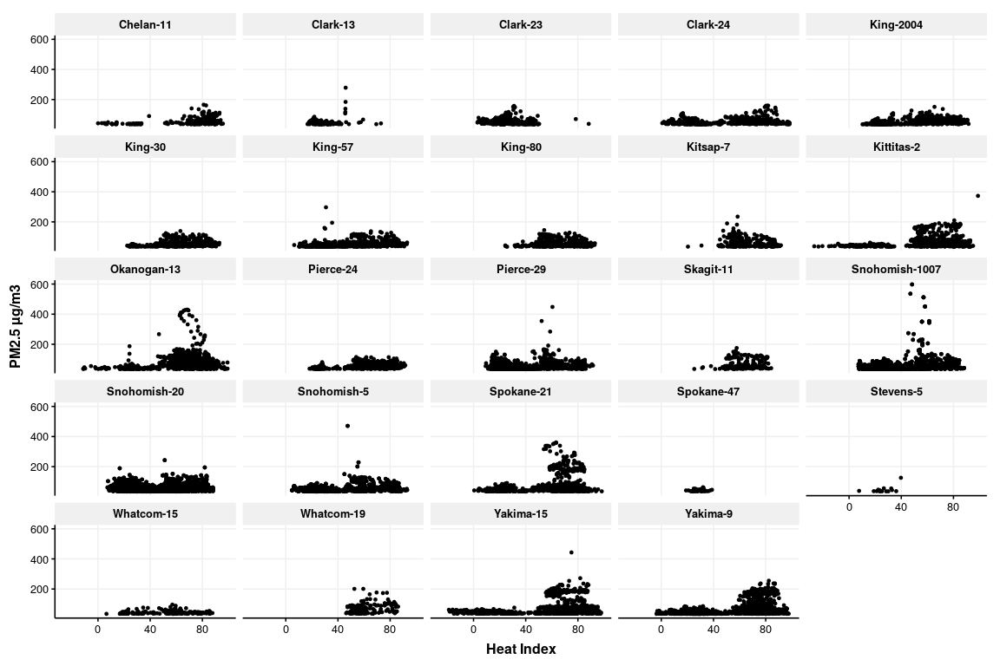
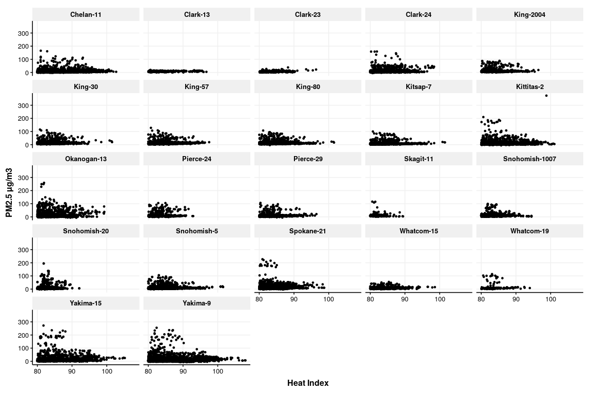

Washington PM2.5 and Heat Episides, 2010-2018
================

## METHODS

### Heat

  - Requested AWN data (with data QA date pre-2010) from locations
    nearest EPA PM sites for 2010-2018
  - Computed heat index using Rothfusz approach

### PM2.5

  - Downloaded [EPA PM data for
    2010-2018](#https://aqs.epa.gov/aqsweb/airdata/download_files.html)
  - Merged with heat data
  - Computed nearest Haversine distance between AWN and EPA sites

### Plots

  - Histograms for temp, relative humidity, heat index, and PM2.5 (PM2.5
    FRM/FEM Mass (88101))
  - Density plots
  - Time series
  - Scatter plot of heat index vs. PM, 2010-2018 by location (n=24)

### Maps

  - Ag worker population by county
  - PM \* HI by county

## RESULTS

``` r
n.am.asd.gm.gsd(epa.awn.final.wide$Sample.Measurement)
```

    ##             N            AM           ASD            GM           GSD 
    ##  1.249088e+06  7.391722e+00  9.896051e+00           Inf           Inf 
    ##           Min           Max 
    ## -1.000000e+01  5.976000e+02

``` r
n.am.asd.gm.gsd(epa.awn.final.wide$hi)
```

    ##             N            AM           ASD            GM           GSD 
    ## 1249088.00000      49.86747      14.44313           Inf           Inf 
    ##           Min           Max 
    ##     -26.69325     107.98591

``` r
ggplot(epa.awn.final.wide, aes(x=AIR_TEMP_F))            + geom_histogram() + theme_HEI(10) + xlab("Air Temperature (F)") + ylab("Count")
```

<!-- -->

``` r
ggplot(epa.awn.final.wide, aes(x=`RELATIVE_HUMIDITY_%`)) + geom_histogram() + theme_HEI(10) + xlab("Relative Humidity (%)") + ylab("Count")
```

<!-- -->

``` r
ggplot(epa.awn.final.wide, aes(x=hi))                    + geom_histogram() + theme_HEI(10) + xlab("Heat Index") + ylab("Count")
```

<!-- -->

``` r
ggplot(epa.awn.final.wide, aes(x=Sample.Measurement))    + geom_histogram() + theme_HEI(10) + xlab("PM2.5 µg/m3") + ylab("Count")
```

<!-- -->

``` r
ggplot(epa.awn.final.wide[!is.na(hi)], aes( `hi`, y=..density..)) + 
  geom_density() + 
  geom_vline(xintercept = 80, col = "red") +
  facet_wrap(~Site, scales = "free") +
  geom_histogram(aes(y=..density..), alpha=0.5, position="identity") +
  xlim(0, 100) + 
  theme_HEI(12) + 
  xlab("Heat Index")
```

<!-- -->

``` r
ggplot(epa.awn.final.wide[!is.na(`Sample.Measurement`)], aes( `Sample.Measurement`, y=..density..)) + 
  geom_density() + 
  geom_vline(xintercept = 35, col = "red") +
  facet_wrap(~Site, scales = "free") +
  geom_histogram(aes(y=..density..), alpha=0.5, position="identity")+
  xlim(0, 100) + 
  theme_HEI(12) + 
  xlab("PM2.5 µg/m3")
```

<!-- -->

``` r
ggplot(epa.awn.final.long, aes(x=datetime_PST, y=value, color=factor(variable))) + geom_line() + facet_wrap(facets = vars(Site)) + theme_HEI(12) + xlab("Year") + ylab("")
```

<!-- -->

``` r
#All data

ggplot(epa.awn.final.wide, aes(x=hi, y=Sample.Measurement)) + geom_point(size=1) + facet_wrap(facets = vars(Site)) + theme_HEI(12) + xlab("Heat Index") + ylab("PM2.5 µg/m3")
```

<!-- -->

``` r
#PM data above 35 ug/m3

ggplot(epa.awn.final.wide[epa.awn.final.wide$Sample.Measurement>35], aes(x=hi, y=Sample.Measurement)) + geom_point(size=1) + facet_wrap(facets = vars(Site)) + theme_HEI(12) + xlab("Heat Index") + ylab("PM2.5 µg/m3")
```

<!-- -->

``` r
#Heat index data above 80

ggplot(epa.awn.final.wide[epa.awn.final.wide$hi>80], aes(x=hi, y=Sample.Measurement)) + geom_point(size=1) + facet_wrap(facets = vars(Site)) + theme_HEI(12) + xlab("Heat Index") + ylab("PM2.5 µg/m3")
```

<!-- -->

## REFERENCES
